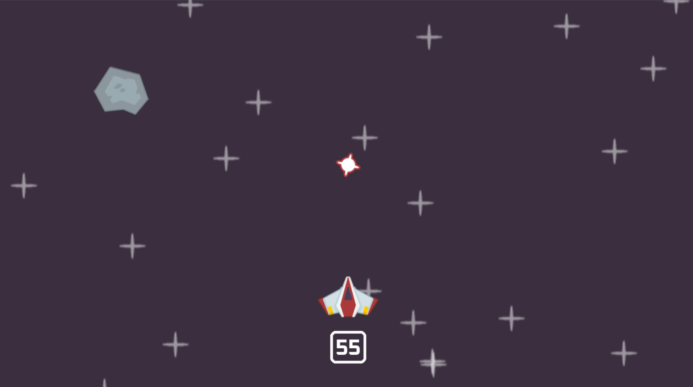

# 🚀 Space Shooter 🎮

A fast-paced **2D arcade shooter** built using **Python** and **Pygame**, where you dodge meteors and blast them away with lasers! Perfect for learning game loops, sprite handling, collision detection, and animation in Pygame.

---

## ✨ Features

* 🎮 Smooth 2D movement with arrow keys
* 🔫 Laser shooting with cooldown logic
* 🌠 Random meteor spawning
* 💥 Explosion animations and sound effects
* 🕹 Real-time score tracking

---

## 🔧 Game Rules

* Use **arrow keys** to move the player spaceship.
* Press **spacebar** to shoot lasers.
* **Destroy incoming meteors** before they hit you.
* Survive as long as possible to increase your score!

---

## 📷 Screenshot

---

## 🧠 Technologies Used

* Python 3.x

* Pygame

* Random module

* OS module

---

## 💡 Future Improvements

* Health system and Game Over screen

* Level progression and increasing difficulty

* Power-ups and new weapons

* Modular file structure

---

## 📄 License

This project is licensed under the MIT License.

---

## 🙌 Acknowledgements

Inspired by classic arcade games and built as a learning project to explore the power of Pygame and 2D game development.

---

# Made with ❤️ by Rachit Khowal
